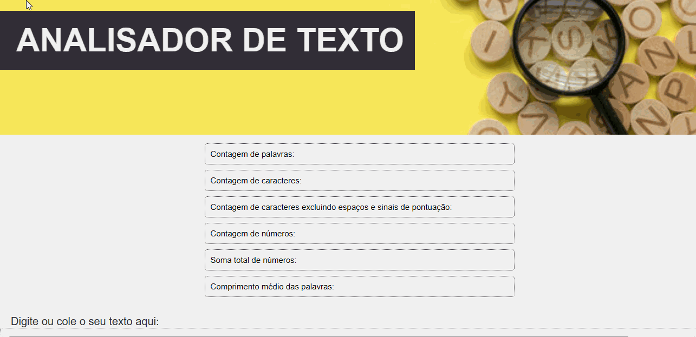

## Índice

- [1. Considerações gerais](#1-considerações-gerais)
- [2. Preâmbulo](#2-preâmbulo)
- [3. Resumo do projeto](#3-resumo-do-projeto)
- [4. Funcionalidades](#4-funcionalidades)
- [5. Boilerplate](#5-boilerplate)
- [6. Objetivos de Aprendizagem](#6-objetivos-de-aprendizagem)
- [7. Testes](#7-testes)
- [8. Ferramentas](#8-Ferramentas)
- [9. Considerações para solicitar seu Feedback de Projeto](#9-considerações-para-solicitar-seu-feedback-de-projeto)
- [10. Colaboração e suporte](#10-colaboração-e-suporte)
- [11. Considerações finais](#11-Considerações-finais)

---

## 1. Considerações gerais

- Este projeto foi desenvolvido de forma **individual**, com apoio da equipe e das colegas do Bootcamp de Desenvolvimento Front-end da **Laboratória**.
- O projeto foi realizado em 3 Sprints.
- O principal objetivo desse projeto é a aprendizagem e o desenvolvimento de habilidades técnicas e softskills.

## 2. Preâmbulo

Um analisador de texto é uma aplicação para extrair informações úteis de 
um texto. Essa aplicação pode fornecer uma variedade de métricas que oferecem
informações básicas: contagem de palavras, contagem de caracteres, contagem de 
caracteres excluindo espaços e sinais de pontuação, contagem de números, soma 
total de números e comprimento médio das palavras.
Em geral, as aplicações de análise de texto fornecem informações e métricas sobre
os textos que podem ajudar as usuárias a tomar decisões e tirar conclusões significativas. 

## 3. Resumo do projeto

Neste projeto, foi desenvolvida uma aplicação que permite a usuária analisar no navegador,
um texto inserido por ela, obtendo uma séria de indicadores e métricas específicas sobre caracteres, letras, números, etc.
O analisador de texto foi desenvolvido utilizando HTML, CSS e JavaScript.

## 4. Funcionalidades

A lista de funcionalidades é a seguinte:

1. A aplicação permite que a usuária insira um texto escrevendo-o
    em uma caixa de texto.

2. A aplicação calcula as seguintes métricas e atualiza o
    resultado em tempo real conforme a usuária escreve o texto:

    - **Contagem de palavras**: a aplicação é capaz de contar o número de
    palavras no texto de entrada e mostrar essa contagem para a usuária.
    - **Contagem de caracteres**: a aplicação é capaz de contar o número de
    caracteres no texto de entrada, incluindo espaços e sinais de
    pontuação, e mostra essa contagem para a usuária.
    - **Contagem de caracteres excluindo espaços e sinais de pontuação**:
    a aplicação é capaz de contar o número de caracteres no texto de
    entrada, excluindo espaços e sinais de pontuação, e mostra essa contagem
    para a usuária.
    - **Contagem de números**: a aplicação é capaz de contar quantos números há no
    texto de entrada e mostra essa contagem para a usuária.
    - **Soma total dos números**: a aplicação é capaz de somar todos os números que
    estão no texto de entrada e mostra o resultado para a usuária.
    - **Comprimento médio das palavras**: a aplicação é capaz de calcular o
    comprimento médio das palavras no texto de entrada e mostra esse valor para a usuária.

3. A aplicação permite limpar o conteúdo da caixa de texto ao clicar
    em no botão "LIMPAR TEXTO".

## 5. Boilerplate

A lógica deste projeto foi implementada em javascript. Não foi permitido o uso de bibliotecas e frameworks, apenas JavaScript puro, também conhecido como Vanilla Javascript.
Para começar este projeto, foi feito -fork_ e clone de um repositório da **Laboratória**, a partir do qual foi fornecida a estrutura básica com arquivos e configuração inicial de dependêncuas e testes, o _boilerplate_.
O _boilerplate_ continha a seguinte estrutura:

    ./
    ├── .babelrc
    ├── .editorconfig
    ├── .eslintrc
    ├── .gitignore
    ├── README.md
    ├── package.json
    ├── src
    │   ├── analyzer.js
    │   ├── index.html
    │   ├── index.js
    │   └── style.css
    └── test
        ├── .eslintrc
        └── analyzer.spec.js

### Descrição de scripts / arquivos implementados no desenvolvimento do projeto.

- **`README.md`**: este arquivo a princípio continha as orientações e regras para a execução do projeto. E posteriormente, foi editado para o presente arquivo com as descrições e observações sobre a conclusão do projeto.

- **`src/index.html`**: este arquivo contém o HTML, que fornece a estrutura da página.

- **`src/style.css`**: este arquivo contém o CSS, que configura as regras de
estilo da página. Não foi permitido o uso de frameworks de CSS (Bootstrap, Materialize, etc).

- **`src/index.js`**: este arquivo contém os escutadores de eventos do DOM,
que invoca os métodos do objeto `analyzer` conforme necessário e atualiza o resultado na IU 
(interface de usuária). Na execução foram utilizados os métodos: getElementById, querySelector e addEventListener.

- **`src/analyzer.js`**: este arquivo contém o objeto `analyzer`, com os seis métodos:

  + `analyzer.getWordCount(text)`: esta função retorna a contagem de
  palavras que estão no parâmetro `text` do tipo `string`.
  + `analyzer.getCharacterCount(text)`: esta função retorna a
  contagem de caracteres que estão no parâmetro `text` do tipo `string`.
  + `analyzer.getCharacterCountExcludingSpaces(text)`: esta função
  retorna a contagem de caracteres excluindo espaços e sinais de pontuação
  que estão no parâmetro `text` do tipo `string`.
  + `analyzer.getNumberCount(text)`: esta função retorna quantos
  números estão no parâmetro `text` do tipo `string`.
  + `analyzer.getNumberSum(text)`: esta função retorna a soma de todos os
  números que estão no parâmetro `text` do tipo `string`.
  + `analyzer.getAverageWordLength(text)`: esta função retorna o
  comprimento médio das palavras que estão no parâmetro `text` do tipo
  `string`. Usando 2 casas decimais. 

  _Nota: para simplificar as funcionalidades, definiremos palavras como grupos
  de caracteres separados por espaços. Por exemplo, as palavras no texto de
  entrada `Sim, você consegue fazer!` são quatro:_

  + _`Sim,`_
  + _`você`_
  + _`consegue`_
  + _`fazer!`_

---

## 6. Objetivos de Aprendizagem

### HTML

- **Uso de HTML semântico**

  + [ ] A aplicação possui um cabeçalho composto por um
        `<header>` que é pai de um `<h1>`com o texto `Analisador de texto`. Para que você possa praticar mais, esses
        elementos não podem ter atributos `id`, `name` ou `class`.

  + [ ] A aplicação utiliza um
        `<textarea>` com o atributo `name` com o valor `user-input` para permitir à usuária
        inserir um texto. Para que você possa praticar mais, este elemento não pode
        ter atributos `id` ou `class`.

  + [ ] A aplicação utiliza uma
        `<ul>`com 6 filhos `<li>`, um para exibir cada métrica. Para que você possa praticar mais, esses
        elementos não podem ter atributos `id`, `name` ou filhos.

  + [ ] O `<li>` para exibir a _contagem de palavras_ deve ter um atributo`data-testid` com o valor `word-count`.

  + [ ] O `<li>` para exibir a _contagem de caracteres_ deve ter um atributo
        `data-testid` com o valor `character-count`.

  + [ ] O `<li>` para exibir a _contagem de caracteres excluindo espaços e sinais de pontuação_
        deve ter um atributo `data-testid` com o valor `character-no-spaces-count`.

  + [ ] O `<li>`para exibir a _contagem de números_ deve ter um atributo `data-testid` com o valor `number-count`.

  + [ ] O `<li>` para exibir a _soma total de números_ deve ter um atributo `data-testid` com o valor `number-sum`.

  + [ ] O `<li>`
        para exibir o _comprimento médio das palavras_ deve ter um atributo `data-testid` com o valor `word-length-average`.

  + [ ] A aplicação possui um rodapé composto por um
        `<footer>` que é pai de um `
` que possui o nome da estudante desenvolvedora da aplicação como texto.
        Para que você possa praticar mais, esses elementos não podem ter atributos `id`, `name` ou `class`.

  + [ ] A aplicação utiliza um `<button>` com o atributo `id` com o valor `reset-button` para permitir à usuária, através de um clique, limpar o conteúdo da caixa de texto.

### CSS

- **Uso de seletores CSS**

  + [ ] A aplicação utiliza
        `seletores CSS de tipo`
        para estiliz
        e o
        `<footer>`.

  + [ ] A aplicação utiliza
        `seletores CSS de classe` para estilizar os
        `<li>` mencionados anteriormente.

  + [ ] A aplicação utiliza
        `seletores de atributo` para estilizar o
        `<textarea>` utilizando o atributo `name`.

  + [ ] A aplicação utiliza
        `seletores CSS de ID` para estilizar o
        `<button>`com o atributo `id` com o valor `reset-button`.

- **Modelo de caixa (box model): borda, margem, preenchimento**

  + [ ] As
        `classes CSS`
        dos
        `<li>`
        filhos da
        `<ul>`
        definem um estilo usando as propriedades do
        modelo de caixa,
        `background`,
        `border`,
        `margin`
        `padding`.

### Web APIs

- **Uso de seletores do DOM**

  + [ ] A aplicação utiliza o
        `seletor do DOM querySelector`.

  + [ ] A aplicação utiliza o
        `seletor do DOM getElementById`.

- **Manipulação de eventos do DOM (ouvintes, propagação, delegação)**

  + [ ] A aplicação registra um
        Event Listener
        para ouvir o evento `keyup` do `<textarea>` e atualizar as métricas
        quando o texto for digitado na caixa de texto.

  + [ ] A aplicação registra um
        Event Listener
        para ouvir o evento `click` do `<button>` que limpa o conteúdo da caixa
        de texto.

- **Manipulação dinâmica do DOM**

  + [ ] A aplicação atualiza o atributo
        `textContent`
        ou
        `innerHTML`
        dos `<li>` que exibem as métricas do texto.

### JavaScript

- **Tipos de dados primitivos**

  + [ ] A aplicação converte valores do tipo `string` para o tipo `number`.

- **Strings (cadeias de caracteres)**

  + [ ] A aplicação utiliza métodos para manipular strings como
        `split`,
        `trim`
        ou
        `replace`.

- **Variáveis (declaração, atribuição, escopo)**

  + [ ] A aplicação declara variáveis com
        `let`
        e
        `const`.

  + [ ] A aplicação NÃO declara variáveis com `var`.

- **Uso de condicionais (if-else, switch, operador ternário, lógica booleana)**

  + [ ] A aplicação utiliza a estrutura
        `if..else`
        para avaliar condições.

- **Uso de loops (while, for, for..of)**

  + [ ] A aplicação utiliza a estrutura
        `for`
        para criar um loop.

- **Funções (parâmetros, argumentos, retorno)**

  + [ ] O objeto `analyzer` contém um método `getWordCount` para calcular a
        contagem de palavras de um texto.

  + [ ] O objeto `analyzer` contém um método `getCharacterCount` para calcular a
        contagem de caracteres de um texto.

  + [ ] O objeto `analyzer` contém um método `getCharacterCountExcludingSpaces`
        para calcular a contagem de caracteres excluindo espaços e pontuações
        de um texto.

  + [ ] O objeto `analyzer` contém um método `getNumbersCount` para contar quantos
        números existem em um texto.

  + [ ] O objeto `analyzer` contém um método `getNumbersSum` para calcular a soma
        dos números em um texto.

  + [ ] O objeto `analyzer` contém um método `getAverageWordLength` para calcular
        o comprimento médio das palavras em um texto.

- **Testes unitários (unit tests)**

  + [ ] Todos os testes unitários passam.

- **Módulos do ECMAScript (ES Modules)**

  + [ ] A aplicação utiliza
        `import`
        e
        `export`
        para importar e exportar valores de um módulo JavaScript.

- **Uso de linter (ESLINT)**

  + [ ] Ao executar o linter, não são exibidos erros de formato e estilo.

- **Uso de identificadores descritivos (Nomenclatura e Semântica)**

  + [ ] O código utiliza identificadores descritivos para variáveis e funções.

### Controle de Versões (Git e GitHub)

- **GitHub: Criação de conta e repositórios, configuração de chaves SSH**

  + [ ] Criação de uma conta no Github.

  + [ ] Configuração da conta do Github com uma chave SSH.

- **Git: Controle de versões com git (clone,status, add, commit, push, deploy)**

  + [ ] Criação de um _fork_ para o projeto.

  + [ ]  Clonagem do repositório usando uma chave SSH.

  + [ ] Criação de _commits_, _push_ e _deploy_ no Github.

- **GitHub: Implantação com GitHub Pages**

  + [ ] A aplicação está implantada no GitHub Pages:
  [Text Analyzer](https://camilasukhada.github.io/SAP012-text-analyzer/).

### Foco na Usuária

- **Projetado e desenvolvido um produto ou serviço centrado nas usuárias**

### Design do Produto

- **O projeto foi desenvolvido respeitando os princípios básicos do design visual**

  + [ ] Foram consideradas as regras básicas de
        design visual: contraste, alinhamento e hierarquia.

- **O projeto escolheu como inspiração o seguinte modelo:**

## 7. Testes

Este projeto conta com 3 conjuntos de testes que ajudam a verificar se
os critérios mínimos de aceitação são cumpridos.

### Testes Unitários

Um teste unitário é uma técnica de teste de software na qual se verifica
que cada componente individual de um programa ou sistema funcione corretamente
isoladamente. Em outras palavras, cada unidade de código é testada separadamente
para garantir que atenda aos requisitos e especificações.

Os testes unitários deste projeto executam os métodos `getWordCount`,
`getCharacterCount`, `getCharacterCountExcludingSpaces`, `getNumbersCount`,
`getNumbersSum` e `getAverageWordLength` com diferentes argumentos e verificarão
se os valores retornados são os esperados.

Esses testes são executados com o comando `npm run test` como mostrado
na imagem a seguir:

O _boilerplate_ inclui tarefas que executam [eslint] e
[htmlhint] para verificar o `HTML` e
`JavaScript` em relação a diretrizes de estilo. Ambas as tarefas são executadas
automaticamente antes de executar os testes unitários ao usar o comando
`npm run test`. No caso do `JavaScript`, é um arquivo de configuração
do `eslint` chamado `.eslintrc`, que contém informações mínimas sobre o parser
a ser usado (qual versão do JavaScript/ECMAScript), o ambiente (navegador neste caso)
e as regras recomendadas (`eslint:recommended`).
Em relação às próprias regras/diretrizes de estilo,
segue-se as recomendações _padrão_ tanto do `eslint` quanto do `htmlhint`.

### Testes de Critérios Mínimos de Aceitação

Esses testes analisam os arquivos
[`index.html`](src/index.html),
[`index.js`](src/index.html),
[`analyzer.js`](src/analyzer.js)
e
[`style.css`](src/style.css)
para verificar se cumpre os
[critérios mínimos de aceitação](#6-critérios-de-aceitação-mínimos-do-projeto).
Cada critério está relacionado a um objetivo de aprendizado.

São executados todos esses testes com o comando `npm run test:oas`
como mostrado na imagem a seguir:

Também é possível executar os testes de cada grupo de objetivos de aprendizado
individualmente com os seguintes comandos:

- 
- 
- 
- 

#### Testes End-to-End

Um teste end-to-end (E2E) é uma técnica de teste de software na qual se verifica
o funcionamento de todo o sistema, do início ao fim. Em outras palavras, é testado
o fluxo completo do software, simulando a interação da usuária com a aplicação,
para garantir que todas as partes do sistema funcionem corretamente em conjunto.

É possível executar esses testes com o comando `npm run test:e2e` como mostrado
na imagem a seguir:

#### Deploy

A aplicação foi publicada (ou _deployed_) para que as usuárias da
web possam acessá-la.

Neste projeto, foi utilizado o _Github Pages_ para implantar o site: [Text Analyzer](https://camilasukhada.github.io/SAP012-text-analyzer/).

## 8. Ferramentas

### Preparo do PC para trabalhar

+ Node.js
+ Git e GitBash
+ Playwright
+ Visual Studio Code

### Organização e planejamento

+ Trello: [Text Analyzer](https://trello.com/b/pqcyhlho/text-analyzer).

### Organização e planejamento

+ GitHub

### Linguagens

+ HTML

+ CSS

+ JavaScript

Junte-se ao canal do Slack [#project-text-analyzer-pt](https://claseslaboratoria.slack.com/archives/C067QN2GFCM)

## 9. Colaboração e suporte

<table>
  <tr>
    <td align="center"><a href="https://github.com/Laboratoria"> <b>Laboratória</b></a> </td>
    <td align="center"><a href="https://github.com/flaviane-lima"> <b>Flaviane Lims</b></a> </td>
    <td align="center"><a href="https://github.com/elizabetefabri"> <b>Elizabete Fabri</b></a> </td>
    <td align="center"><a href="https://github.com/Evy-Oliveira"> <b> Evy Oliveira</b></td>
  </tr>
  <table>

## 11. Considerações finais

A execução do projeto proporcionou a oportunidade de desenvolver muitas habilidades, técnicas e lifeskills. O conhecimento de linguagens, ferramentes e tecnologias, como também organização, planejamento, gestão de tempo, trabalho em equipe, comunicação e autoaprendizagem. Superar os desafios de um primeiro projeto trouxe satisfação e autoconfiança. Só a agradecer!

### Autora
---

<a href="https://github.com/camilasukhada">
 
  
 <b>Camila Sukhada</b></a>

Feito por Camila de Oliveira Batista de Lara. Entre em contato!

 

